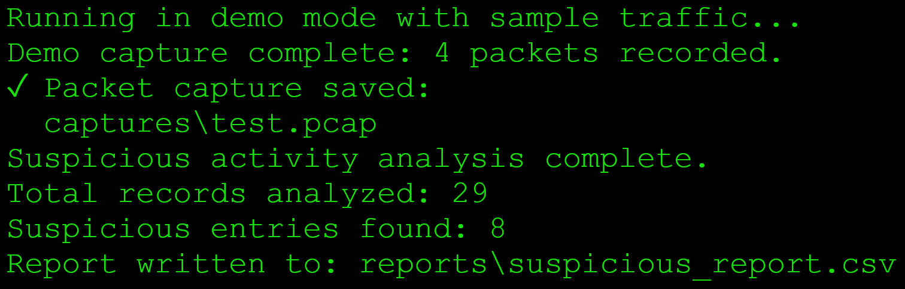
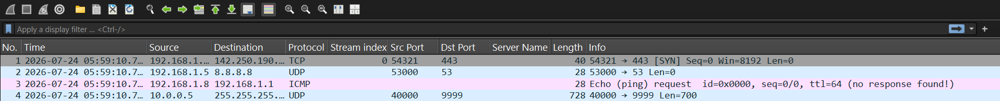
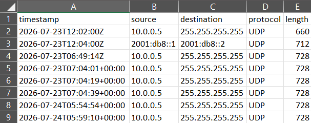
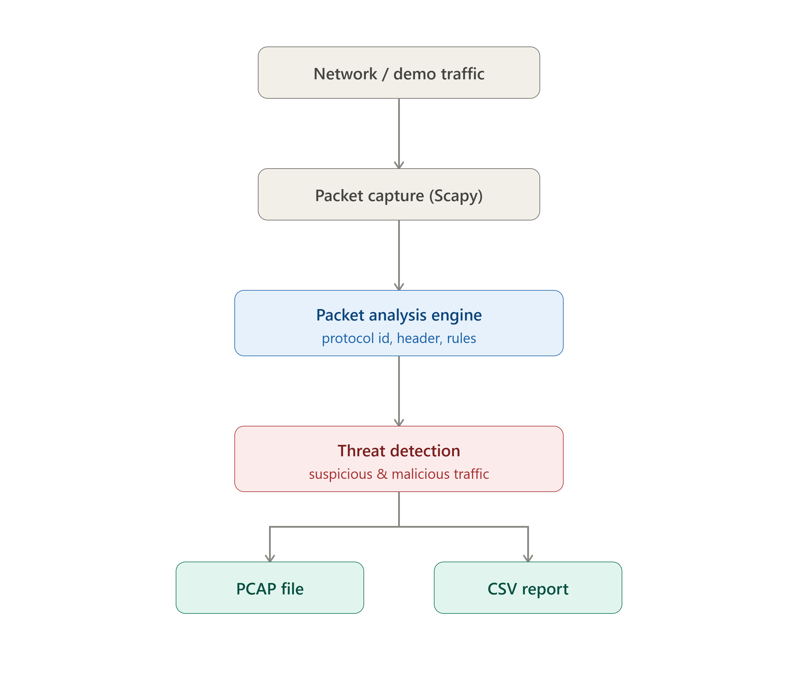

# PacketGuard

> Real-time Network Threat Detection and Packet Analysis Tool


---

## Overview

PacketGuard is a Python-based network security tool that captures and analyzes live network traffic to identify suspicious packets in real time. It performs protocol inspection, detects predefined network anomalies, and generates structured reports for further investigation.

---

## Features

- Live packet capture
- Packet inspection and protocol analysis
- Suspicious traffic detection
- Automatic CSV report generation
- Lightweight Python implementation
- Easily extendable detection rules

---

## Tech Stack

- Python
- Scapy
- CSV
- Socket Programming

---

## Screenshots

### Terminal Output

Displays PacketGuard running and generating the analysis report.



---

### Packet Capture

Shows the captured PCAP data ready for analysis.



---

### Threat Report

A structured suspicious traffic report exported to CSV.



---

### Architecture

Illustrates the packet processing pipeline.



---

## Project Structure

```text
PacketGuard/
│
├── captures/
├── logs/
├── reports/
├── screenshots/
├── packet_guard.py
├── README.md
├── requirements.txt
└── LICENSE
```

---

## Installation

```bash
git clone https://github.com/RudraK9905/PacketGuard.git

cd PacketGuard

pip install -r requirements.txt
```

---

## Usage

Run it on a local machine with demo traffic:

```bash
python3 packet_guard.py --demo --duration 3
```

Or run a live capture on a real interface:

```bash
sudo python3 packet_guard.py --interface eth0 --duration 10
```

PacketGuard will begin monitoring network traffic and automatically generate reports for suspicious packets.

---

## Future Improvements

- Machine Learning based anomaly detection
- Threat Intelligence API integration
- Web dashboard
- Email notifications
- PCAP upload support
- Interactive analytics

---

## License

This project is licensed under the MIT License.
